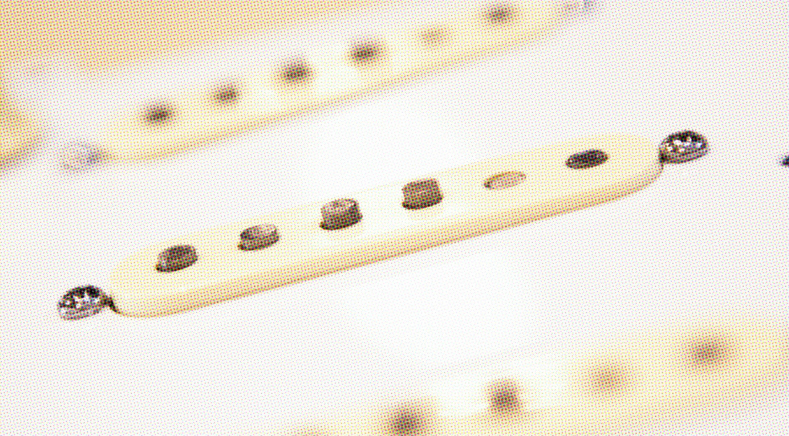
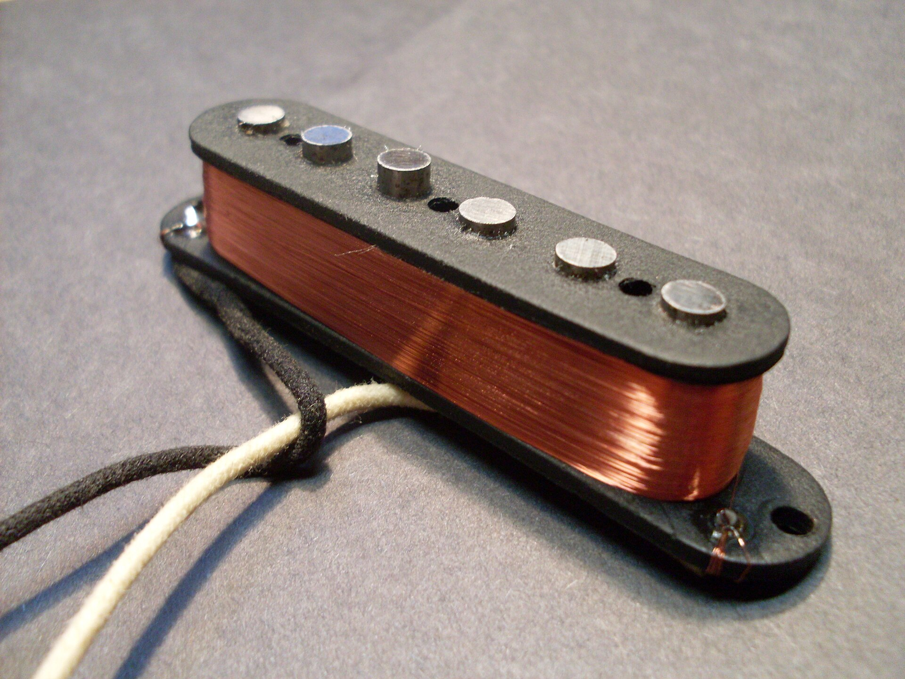
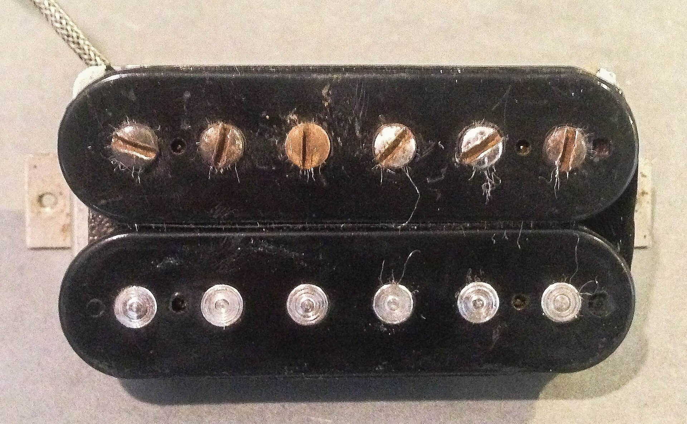

import PickupAnatomyDiagram from "../components/diagrams/PickupAnatomyDiagram.astro";
import InductionDiagram from "../components/diagrams/InductionDiagram.astro";
import SignalAnatomyDiagram from "../components/diagrams/SignalAnatomyDiagram.astro";
import PickupPositionDiagram from "../components/diagrams/PickupPositionDiagram.astro";
import HumCancellationDiagram from "../components/diagrams/HumCancellationDiagram.astro";
import SignalChainDiagram from "../components/diagrams/SignalChainDiagram.astro";

{/* _class: impact */}

SLOP2186 &middot; Week 3

# From Vibration to Voltage

How a magnetic pickup turns string motion into an electrical signal.

Slop University &middot; SLOP2186

---

{/* _class: centered */}

The question

String moves.

Cable carries a voltage.

What happens in between?

---

{/* _class: centered signal */}

The missing link

STRING &rarr; ? &rarr; VOLTAGE

Something between the string and the cable has to turn motion into an
electrical signal.

---

# Meet the pickup

A magnetic pickup sits under the strings and does exactly one job: sense
string motion and turn it into a voltage — no moving parts touch the string
at all.

Photo: John Tuggle &middot; CC BY 2.0

---

{/* _class: diagram */}

# Pickup anatomy

<PickupAnatomyDiagram />

Magnet, pole piece, coil &mdash; the three physical parts

---

{/* _class: diagram */}

# Motion changes flux

<InductionDiagram />

A still string: constant flux, no output. A moving string: changing flux, a voltage appears.

---

{/* _class: diagram signal */}

# Faraday's law

<InductionDiagram equation />

The induced voltage is proportional to how fast the flux changes, not the string's position

---

{/* _class: diagram signal */}

# What's in the voltage

<SignalAnatomyDiagram />

Amplitude, period, and a harmonic series &mdash; not one pure tone

---

{/* _class: diagram signal */}

# Position is sampling

A pickup only senses motion at the one point it sits at, so it samples the
string's standing-wave modes at that location.

<PickupPositionDiagram />

---

{/* _class: metric signal */}

# Why bridge sounds brighter

&asymp; 1/5

the fundamental's relative amplitude at a bridge-like position &mdash; weaker there, so upper harmonics dominate more of the balance

---

# The single coil

One magnet, one coil, several thousand turns of fine copper wire — simple,
and with nothing to reject interference it picks up along the way.

Photo: William Warby &middot; CC BY 2.0

---

# The humbucker

Two coils, wound and wired in opposition, sensing the same string from two
adjacent points.

Photo: William Warby &middot; CC BY 2.0

---

{/* _class: diagram signal */}

# Noise cancellation

<HumCancellationDiagram />

Interference arrives alike at both coils and cancels; the string arrives opposite and adds

---

{/* _class: split */}

Recap

# Single-coil vs. humbucker

**Single-coil** &mdash; one coil, senses interference along with the string,
brighter and more position-sensitive.

**Humbucker** &mdash; two opposed coils; common-mode interference cancels
while the string's signal adds. Comparatively darker, higher output, and
quiet.

---

{/* _class: signal */}

# Listening: try it

Open this week's page and drag the pickup along the string in
[PickupLab](../../lectures/week-03/#pickup-lab) — the sound moves with the
curve, because the same expression drives both.

---

{/* _class: diagram */}

# The full causal chain

<SignalChainDiagram
  stages={[
    { label: "Vibration", caption: "the string moves" },
    { label: "Flux change", caption: "the field through the coil rises and falls" },
    { label: "Induced voltage", caption: "the signal leaving the pickup" },
  ]}
/>

---

{/* _class: banner */}

Next

# The guitar is a circuit

Resistance, capacitance, and the guitar's own volume and tone controls all
shape this voltage before it ever reaches a cable.
